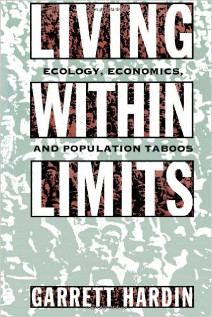

LIVING WITHIN LIMITS is the a book by <a href="https://en.wikipedia.org/wiki/Garrett_Hardin">Garett J. Hardin</a>, late professor of human ecology in University of California Santa Barbara and brave free thinker. Hardin is mostly famous for his seminal paper <a href="https://en.wikipedia.org/wiki/Tragedy_of_the_commons">tragedy of the commons</a> that is about the fact that what seems to be trivially beneficial to an individual in a population and henceforth be taken as a correct course of action by an individual can lead to the demise of the whole population paradoxically, mostly by over-exhausting the resources.

I don't intend to summarize this book, you should read. As the topic suggests in the first 3 chapters Hardin argues that we humans live in a planet with limited resources and we act ignorantly of that. He poses numerous examples that what this type of ignorance may lead us to. for example, the Book tells the story of people of the Easter Island and how they cut down the palm trees and cultivated the land so fast that it caused them to reach their zenith and consequently their downfall by over-using their natural resources on their native island. Another example is about how Saccharo E are 

On part two of this book Hardin talks about the scientific truth and reality that it unfolds. As he remind the reader, one pursuing the truth must ask these questions "What can we know? What does it mean to know? How do we know? What is it we really know?"(p. 48)

---

